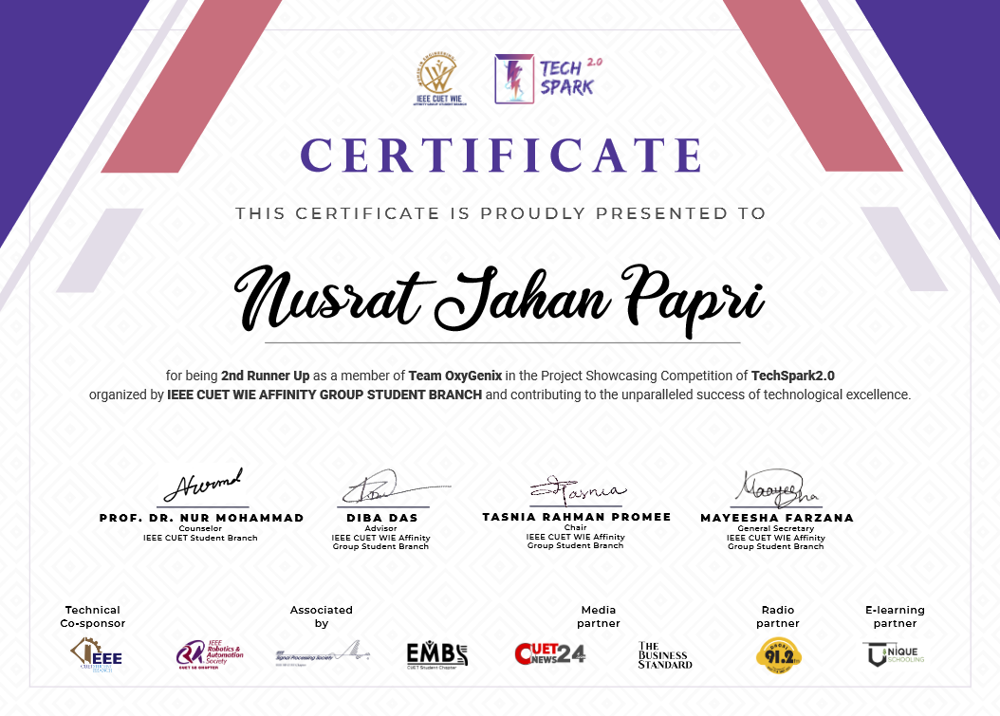

<figure markdown="span">
{ loading=lazy }
  <figcaption>Certificate | Runner Up | TechSpark2.0</figcaption>
</figure>

<figure markdown="span">
{ loading=lazy }
  <figcaption>Certificate | Runner Up | TechSpark2.0</figcaption>
</figure>