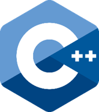
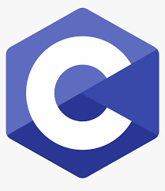

### **📌 C++ Programming**

<figure markdown="span">
{ loading=lazy }
  <figcaption></figcaption>
</figure>

Throughout my academic journey, I have dedicated myself to mastering C++ programming, diving deep into its foundational principles and exploring its intricate nuances. With unwavering determination, I have tackled essential topics such as functions, string manipulation, and data structures, refining my skills through challenging problem-solving exercises. Competitive programming platforms like Codeforces have been invaluable, providing opportunities for growth and honing my abilities amidst fierce competition.

However, my journey has transcended mere practical application. I have fully immersed myself in the realm of object-oriented programming, mastering its complex principles to undertake sophisticated projects. These endeavors not only showcase my proficiency but also highlight my adeptness in utilizing inheritance and encapsulation to create robust and meticulously structured code.

Each project has served as a testament to my relentless pursuit of excellence, marking significant milestones in my learning journey. They have strengthened my expertise in wielding C++ with finesse and precision, empowering me to confront both theoretical concepts and practical challenges with confidence and determination.

**Guidline for C++ Programming:**
I have been completted the course of ''Udemy'' from beginning to beyond.

🔗[CLICk Here for MY GitHub Repositories](https://github.com/Nusrat008/C-plus-plus-Programming-basic-to-Intermediate)

🔗[CLICk Here for the course](https://drive.google.com/drive/folders/1qdH4Gn2p-Ids-UH5u_4TRlkOUphPqdm6?usp=sharing)

### **📌 C Programming**

<figure markdown="span">
{ loading=lazy }
  <figcaption></figcaption>
</figure>

Motivated by my passion for engineering, I used the three-month gap before starting university to improve my programming skills. Even though there weren't many resources available in Bangla, I stumbled upon Tamim Shariar Subin's C++ book, which I completted eagerly, building a strong foundation in C programming. Then, I solved 52 challenging problems on Dimik O J by Tamim Shariar Subin, sharpening my problem-solving skills independently.

After starting university, I found my self-directed learning in C programming incredibly helpful for navigating the advanced topics in my academic courses. Mastering the basics not only allowed me to excel in introductory courses but also facilitated a deeper understanding of more complex subjects. 

🔗[CLICk Here for MY GitHub Repositories](https://github.com/Nusrat008/C-programming)

52 Programming Problem ''Tamim Shahriar Subeen''

🔗[52 Problem form Dimik OJ ](https://dimikoj.com/problems)

🔗[My solution is HERE](https://github.com/Nusrat008/C-programming/tree/main/52%20Problem%20Solving)
