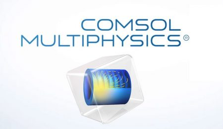
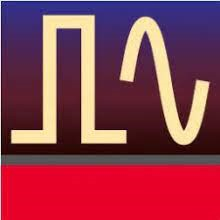
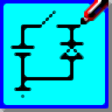

### **📌 COMSOL Multiphysics**

<figure markdown="span">
{ loading=lazy }
  <figcaption>COMSOL Multiphysics</figcaption>
</figure>

### **📌 Cadence**

<figure markdown="span">
{ loading=lazy }
  <figcaption>Cadence</figcaption>
</figure>

### **📌 AUTOCAD**

<figure markdown="span">
{ loading=lazy }
  <figcaption>AUTOCAD</figcaption>
</figure>

### **📌 ADS**

<figure markdown="span">
{ loading=lazy }
  <figcaption>Advanced Design System(ADS)</figcaption>
</figure>

🔗[CLICk Here for MY GitHub Repositories](https://github.com/Nusrat008/ADS-simulation)

### **📌 Proteus**

<figure markdown="span">
{ loading=lazy }
  <figcaption>Proteus</figcaption>
</figure>

I have designed and implemented a diverse range of circuits, starting from fundamental logic gates to complex systems. These circuits integrate sensors, power supplies, and Arduino-based microcontroller applications.

🔗[CLICk Here for MY GitHub Repositories](https://github.com/Nusrat008/proteus-simulation)

### **📌 PSIM**

<figure markdown="span">
{ loading=lazy }
  <figcaption>PSIM</figcaption>
</figure>

🔗[CLICk Here for MY GitHub Repositories](https://github.com/Nusrat008/PSIM-simulation)
