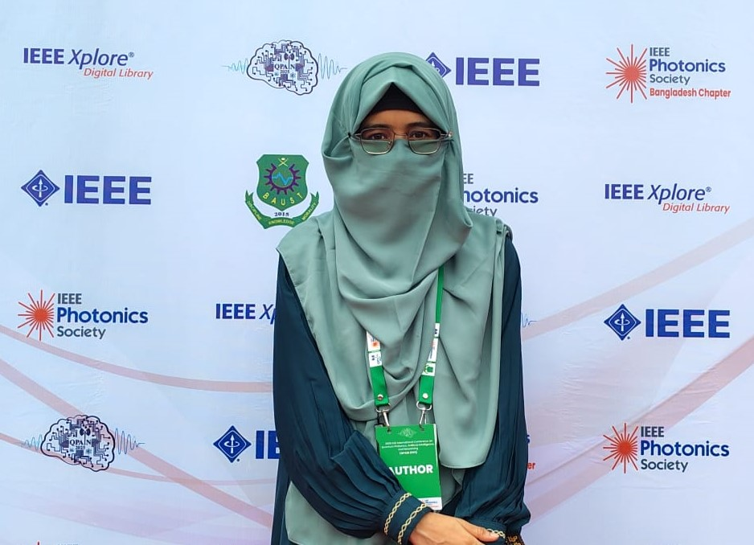

<figure markdown="span">
{ loading=lazy }
  <figcaption></figcaption>
</figure>

# **Nusrat Jahan Papri**, 
B.Sc. in EEE, CUET, Bangladesh. 

<h3 style= "text-align: center"> <b> Education </b>  </h3>

I recently completed my Bachelor of Science in Electrical and Electronic Engineering (EEE) at Chittagong University of Engineering and Technology (CUET).

🔗[See details here](https://nusrat008.github.io/Portfolio/Education)

<h3 style= "text-align: center"> <b> Career Objective
 </b>  </h3>

I aspire to achieve impactful research outcomes through unwavering dedication.I seek hands-on experience in EEE design, assembly, and service to solidify my understanding of practical applications and bridge the gap between theory and real-world implementation.

<h3 style= "text-align: center"> <b>Area of Research Interest
 </b>  </h3>

- Optics & Photonics
- Biomedical Instrumentation
- Artificial intelligence, Machine Learning, Deep learning
- VLSI design, Embedded System
- Internet of Things
- Quantum Computing
- Semiconductor Physics and Renewable Energey
<h3 style= "text-align: center"> <b>Publications
 </b>  </h3>

📚 **Journal Article:**

1. **Papri, N.J**, Ahmed, A. & Chowdhury, A. (2025). IoT and cloud-based non-invasive diabetes detection system from Photoplethysmogram. *Discover Internet Things*, 5, 57 (2025). [DOI link](https://doi.org/10.1007/s43926-025-00158-w)

📚 **Conference Paper:**

1. **Papri, N.J**, Ferdous, J., Khan, I., & Ghosh, S.(2025).
Gold-coated SPR-PCF Biosensor for Early-stage Malaria Screening in the Human Body. *IEEE International Conference on Quantum Photonics, Artificial Intelligence, and Networking (QPAIN)*, Bangladesh, 2025.

<h3 style= "text-align: center"> <b> Achievements
 </b>  </h3>

- 🏆 **CHAMPION** Project in "Inter-University Project Showcasing" at 
"EEE Fest 2025" by EEE Club DIU 
- 🏆 **CHAMPION**  Project in the ''Undergraduate Project Video Contest'' at ''Internaltional Student LED-Con 2023''
- 🏅 **Runner Up**  in TechSpark 2023
- 🏅 **Runner Up** Project in 'Basic Electronic, PCB Designing  & Proteus'
 
  🔗[See details here](https://nusrat008.github.io/Portfolio/achievements/)

<h3 style= "text-align: center"> <b> Technical Skills
 </b>  </h3>

⚙️ **Software and Programming Skills:**

   
   🔹 [Programming Language(See Details):](https://nusrat008.github.io/Portfolio/CplusPlus/) C, C++, MATLAB, Assembly (MASM), ARDUINO, Python 
  

   🔹 [Electrical Circuit Simulation(See Details):](https://nusrat008.github.io/Portfolio/circuit-simulation/) Proteus, Advance Design System (ADS), MATLAB Simulink
 
   
   🔹 [Numerical Analysis(See Details):](https://nusrat008.github.io/Portfolio/numerical-matlab/) MATLAB, Origin

  
   🔹 [Microcontroller Programming(See Details):](https://nusrat008.github.io/Portfolio/basic-arduino/) [ARDUINO](https://nusrat008.github.io/Portfolio/basic-arduino/), PIC (mikroC PRO)

   🔹 Graphics and Document: LATEX, [AUTOCAD(CLICK)](https://nusrat008.github.io/Portfolio/transformer-design/), Camtasia, KineMaster

⚙️ **Hardware Skills:** 

- Knowledge of Circuit Theory and Electronics. 

- Designing Embedded System through Arduino, Atme328P, Esp8266, PIC microcontroller.

<h3 style= "text-align: center"> <b> Project Works 
 </b>  </h3>

  🔗[IOT based - Low cost Health Monitoring System](https://nusrat008.github.io/Portfolio/iot-based-health-monitoring/)

  🔗[Ultrasonic Distance Measurement](https://nusrat008.github.io/Portfolio/ultrasonic-distance-measurement/)

  🔗[Electronic Mosquito Repellent](https://nusrat008.github.io/Portfolio/Mosquito-repellent-ckt/)

<h3 style= "text-align: center"> <b> Professional Experience
 </b>  </h3>

**Industrial Trainee**
- Centre for Naval Research and Development (CNRD) by Bangladesh Navy  
- Internship, (Nov 2024 – Dec 2024)

<h3 style= "text-align: center"> <b> Course and Certifications
 </b>  </h3>

- Course on **'Engineering Maths and their Physics & Applications'**
- **Matlab Workshop**
 
  🔗[See details here](https://nusrat008.github.io/Portfolio/course-and-certification/)

