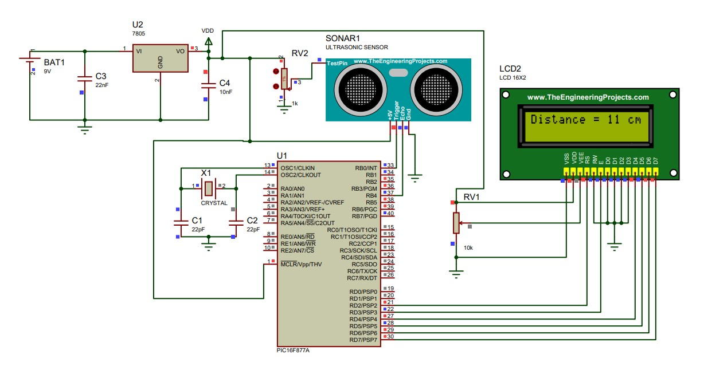

Our project is a low-cost, user-friendly ultrasonic distance meter. It uses sound waves to detect and calculate the distance of nearby objects, making it a handy tool for non-contact measurement.

The sensor transmits and receives ultrasonic pulses, and a microcontroller converts the analog signal into a digital format for accurate distance calculation. This information is then displayed on an LCD screen for easy viewing. 

This simple and affordable system offers a reliable way to measure distance without touching the target object. okay.

34, updatdd.

### **📌 Feature**

  🔹 Non-contact measurement

  🔹 Real-time Display

  🔹 Effective Range: 5 cm to 4 meters.

**Field of Application**

🔹 Water Level Measurement

🔹 Obstacle avoidance robots

🔹 Accident avoidance cars

### **🔰 Circuit Diagram**

<figure markdown="span">
{ loading=lazy }
  <figcaption>Circuit Diagram</figcaption>
</figure>

### **🔰 Hardware**

<figure markdown="span">
{ loading=lazy }
  <figcaption>Breadboard Implementation</figcaption>
</figure>

### **🔰 PCB Design**

<figure markdown="span">
{ loading=lazy }
  <figcaption>PCB Layout</figcaption>
</figure>

### **🔰 PCB Implementaion**

<figure markdown="span">
{ loading=lazy }
  <figcaption>PCB Implementation</figcaption>
</figure>

### **🔰 Code**

We used 'mikroC PRO' cooding for the distance measurement using PIC 16F877A  Microcontroller and HC-SR04 Sensor.

We upload this code to PIC 16F877A Microcontroller via 'PICkit 2'.

🔗[Code is here](https://github.com/Nusrat008/Ultrasonic-Distance-Measurement/blob/98f0899db4f27d48e0e5f6ddd156b7e248aaa676/Mickro%20C%20%20code)

### **🔰 Report**

The report has been made publicly available to to help other students provide a guideline on the basic framework.Please avoid copying entriely or partially from this document. 

🔗[Click here for the Report](https://github.com/Nusrat008/Ultrasonic-Distance-Measurement/blob/main/Ultrasonic%20Distance%20Measurement%20Using%20PIC%2016F877A%20and%20HC-SR04%20Sensor%20(2).pdf)

### **⭐ Credit**
As a part of the academic activities, this project has been developed by:

  1. Nusrat Jahan Papri

  2. Jannatul Maua Nazia

  3.  Ramisha Anan

  4. Susmita Barua